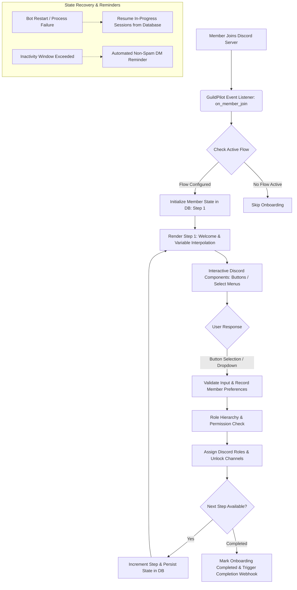

# GuildPilot

[](https://github.com/Moeijiro/guildpilot/actions/workflows/ci.yml)
[](https://opensource.org/licenses/MIT)
[](https://fastapi.tiangolo.com/)
[](https://discordpy.readthedocs.io/)
[](https://nextjs.org/)

> **GuildPilot** is an advanced, stateful Discord onboarding and member journey platform. It guides new community members through interactive multi-step flows, gathers user preferences, automates role provisioning and channel unlocking, and provides server managers with a real-time web dashboard.

---

## Architecture & Interaction Lifecycle



---

## Core Features

- 🧭 **Compact Step-Based Onboarding**: Supports 6 deterministic step types (`Message`, `Button Choice`, `Select Menu`, `Confirmation`, `Role Selection`, `Checklist Item`) without complex, fragile workflow graphs.
- 🛡️ **Defensive Role Automation**: Validates bot role hierarchy, existing permissions, and guild ownership before attempting role assignment to prevent Discord API exceptions (`HTTP 403 Forbidden`).
- 🔓 **Channel Unlocking via Roles**: Unlocks channels through role assignments rather than cluttering channels with member-specific channel permission overwrites.
- 💾 **Durable Multi-Step State Persistence**: Member step progression, selections, and timestamps are persisted in SQLite/PostgreSQL, allowing members to resume onboarding even across bot restarts.
- ⏱️ **Gentle Reminder Queue**: Configurable scheduled reminder jobs (30m, 6h, 24h) with strict low caps to prevent spamming inactive members.
- 🖥️ **Live Discord Interaction Preview**: The web dashboard provides an authentic Discord embed, button, and dropdown live preview renderer for reviewing workflows before publishing.
- 📊 **Real-time Admin Dashboard**: Track new joins, completion rates, drop-off steps, average onboarding duration, and individual member journeys with one-click progress resets.
- 🎭 **Built-in Demo Mode**: Fully functional offline demo mode populated with realistic server onboarding scenarios for quick evaluation without Discord bot credentials.

---

## Step Types Reference

| Step Type | Discord UI Component | Purpose |
|---|---|---|
| `welcome_message` | Embed + "Start Journey" Button | Personalized welcome with dynamic variables (`{{username}}`, `{{server_name}}`, `{{member_count}}`) |
| `button_choice` | ActionRow of interactive Buttons | Single-select categorical choice (e.g. Region: EU, NA, Asia) |
| `select_menu` | String Select Menu (Dropdown) | Multi-selection of interests, programming languages, or platforms |
| `rules_confirm` | Green "Accept Rules" Button | Explicit agreement to server guidelines before proceeding |
| `role_selection` | Interactive Role Buttons | Self-service role opt-in mapped to verified Discord role IDs |
| `checklist_item` | Dynamic Checklist Embed + Mark Complete | Multi-action milestone tracker (e.g. Read FAQ, Introduce Yourself) |

---

## API Reference

| Method | Endpoint | Description |
|---|---|---|
| `GET` | `/api/v1/guilds/{guild_id}/overview` | Overview metrics (completion rate, active members, avg time) |
| `GET` | `/api/v1/guilds/{guild_id}/flow` | Active onboarding flow with ordered steps |
| `POST` | `/api/v1/guilds/{guild_id}/flow/steps` | Create or append a new onboarding step |
| `PUT` | `/api/v1/guilds/{guild_id}/flow/steps/{step_id}` | Edit an existing step configuration |
| `POST` | `/api/v1/guilds/{guild_id}/flow/reorder` | Update step execution sequence |
| `DELETE` | `/api/v1/guilds/{guild_id}/flow/steps/{step_id}` | Delete a step from the flow |
| `GET` | `/api/v1/guilds/{guild_id}/members` | Member onboarding progress table with status filters |
| `POST` | `/api/v1/guilds/{guild_id}/members/{user_id}/reset` | Reset a member's journey back to Step 1 |
| `GET` | `/api/v1/guilds/{guild_id}/logs` | Audit trail of role assignments, resets, and steps |
| `GET` | `/api/v1/demo/sample` | Seeded demo payload for offline exploration |

---

## Tech Stack

- **Backend**: Python 3.11+, FastAPI, `discord.py 2.4`, SQLAlchemy 2.0 (Async), Pydantic v2, pytest
- **Frontend**: Next.js 14 (App Router), React 18, TypeScript, Tailwind CSS, Lucide Icons
- **Database**: SQLite (Development) / PostgreSQL (Production ready)
- **Deployment**: Docker, Docker Compose, GitHub Actions CI

---

## Getting Started

### Backend Setup

```bash
cd backend
python3 -m venv .venv
source .venv/bin/activate
pip install -r requirements.txt -r requirements-dev.txt
cp .env.example .env

# Configure DISCORD_BOT_TOKEN and DISCORD_CLIENT_ID in .env
pytest
uvicorn app.main:app --reload --port 8000
```

### Frontend Setup

```bash
cd frontend
npm install
cp .env.example .env.local
npm run dev
```

Navigate to `http://localhost:3000` to inspect the dashboard and flow builder.

---

## License

MIT © [Moeijiro](https://github.com/Moeijiro)
