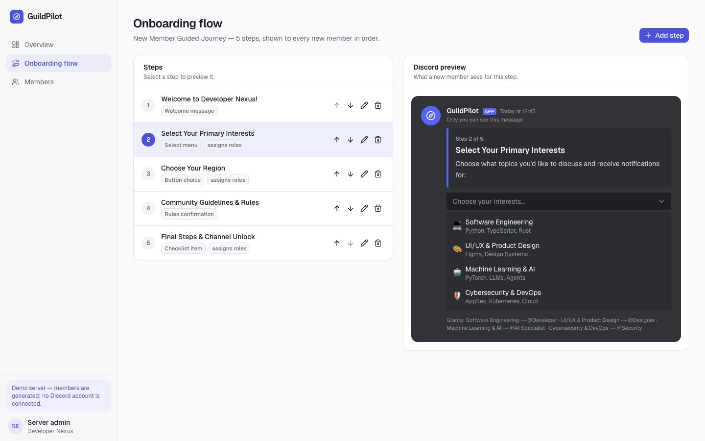
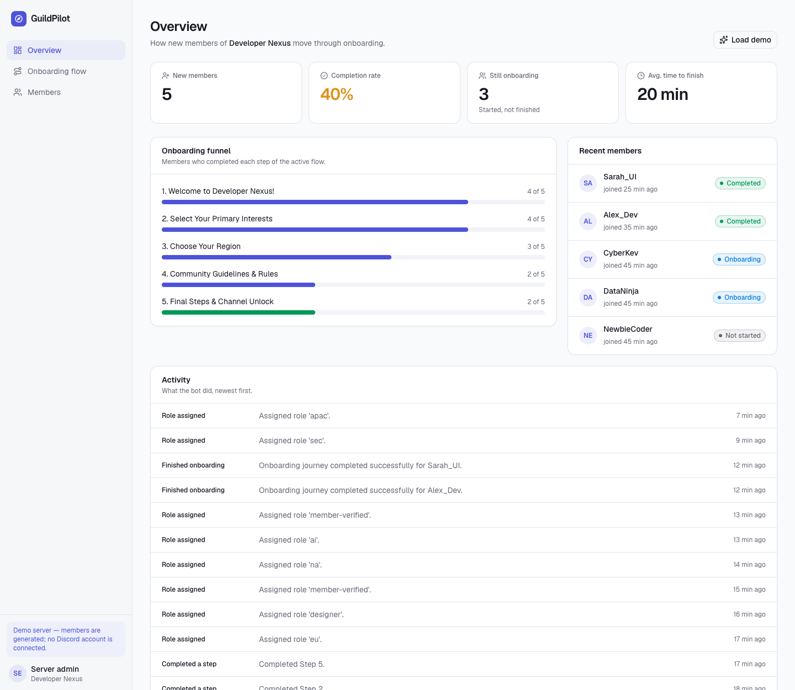
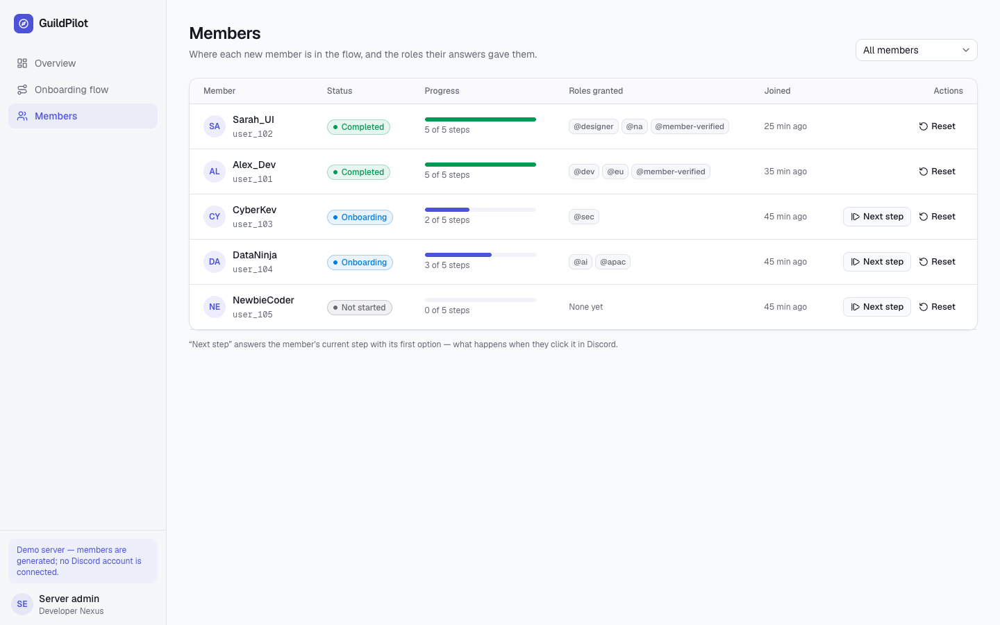
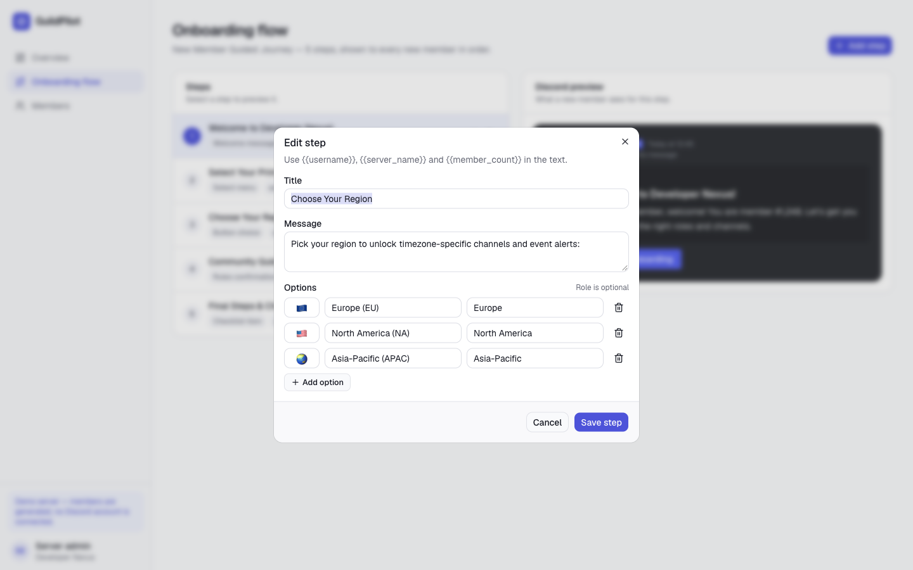
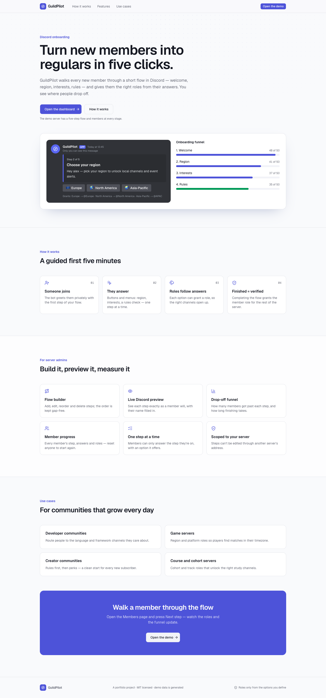
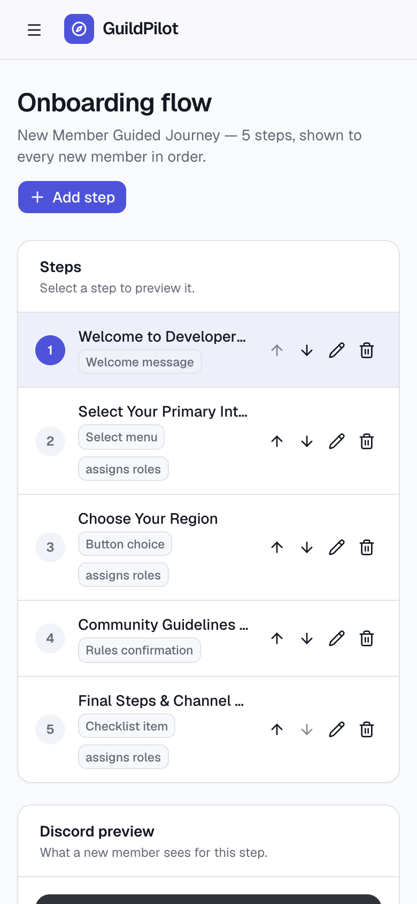
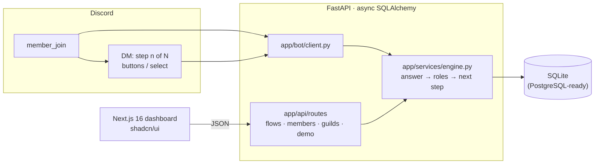
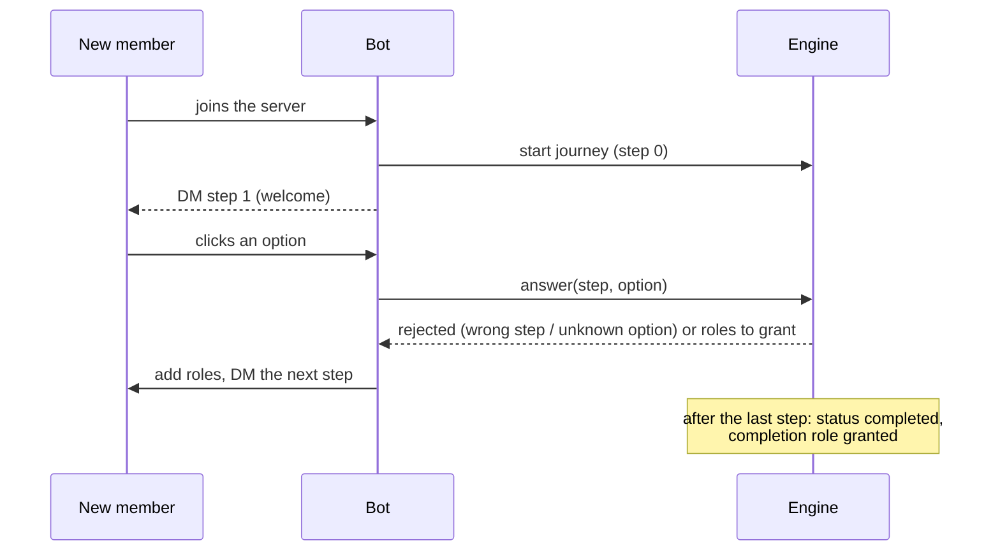

# GuildPilot

**Portfolio case study:** [moeijiro.github.io/portfolio/projects/guildpilot](https://moeijiro.github.io/portfolio/projects/guildpilot/) · **Live demo:** not hosted — the app runs locally in a few commands (see below).

**Turn new members into regulars in five clicks.** When someone joins your Discord
server, GuildPilot walks them through a short flow in a private message: a welcome,
their region, their interests, the rules. Each answer can grant a role, so the right
channels open up. The dashboard lets you build the flow, preview each step exactly as
Discord shows it, and see where people drop off.

It handles onboarding for one server. It is not a general-purpose moderation or
automation bot.

> Portfolio project. The "Developer Nexus" server and its members are fictional. The
> flow and member progress are generated by the seed script.



| Overview and drop-off funnel | Members and granted roles |
| --- | --- |
|  |  |
| **Step editor** | **Landing page** |
|  |  |

<p align="center"></p>

## Contents

- [Features](#features)
- [Architecture](#architecture)
- [Onboarding lifecycle](#onboarding-lifecycle)
- [Security](#security)
- [API overview](#api-overview)
- [Getting started](#getting-started)
- [Demo walkthrough](#demo-walkthrough)
- [Testing](#testing)
- [Environment variables](#environment-variables)
- [Known limitations](#known-limitations)

## Features

**In Discord (`python -m app.bot`)**

- On `member_join`, the bot creates the member's journey and DMs the first step of the
  active flow, filling in `{{username}}`, `{{server_name}}` and `{{member_count}}`.
- Steps are rendered as Discord components: buttons, a select menu, a rules button or a
  checklist button.
- Each answer goes through the same engine as the API. Granted roles are added to the
  member (by role ID, or by name, so `role-member-verified` matches "Member Verified"),
  and the next step arrives straight away.

**In the dashboard**

- **Overview:**
  - New members, completion rate, members still onboarding, and average time to finish.
  - A **drop-off funnel** per step.
  - Recent members and the bot's activity log.
- **Flow builder:**
  - Add, edit, reorder and delete steps.
  - Options take an emoji, a label and an optional role to grant.
  - A Discord-accurate preview of the selected step.
- **Members:**
  - Each member's progress, status and granted roles.
  - **Reset** a journey.
  - A demo **Next step** action that answers as the member would.

**Rules the API enforces**

- Steps can only be edited, deleted or reordered through the server that owns them. A
  reorder must list every step exactly once, and deletes keep the order gap-free.
- A member can only answer the step they're on, with an option that step offers.
  Finished members can't advance further.
- Step types are validated: `welcome_message`, `button_choice`, `select_menu`,
  `role_selection`, `rules_confirm`, `checklist_item`.

## Architecture



```
backend/app
├── api/routes/     flows, members, guilds, demo
├── bot/            discord.py client: member_join, step views, role assignment, python -m app.bot
├── models/         guild (settings, role mapping), flow (flow, steps), member (journey, activity log)
├── schemas/        request/response models, validated step types
├── services/       engine: journeys, answers, roles, completion
├── db/             base, async session
└── seed.py         demo data: python -m app.seed [--reset]
frontend/src
├── app/            landing, (app)/dashboard, (app)/flow-builder, (app)/members
└── components/     kit/ (shared house style), Discord preview, step editor
```

## Onboarding lifecycle



## Security

| Concern | What GuildPilot does |
| --- | --- |
| Cross-server edits | Every step lookup joins the owning flow's server. Another server's step is a 404. |
| Skipping steps | The engine only accepts the member's current step and that step's own options (409 otherwise). |
| Role grants | Roles come only from options an admin configured. Members can't name their own. |
| Closed DMs | If a member has DMs closed, the bot logs it and waits. Nothing is posted publicly. |
| Dashboard access | **Not authenticated.** See [Known limitations](#known-limitations). |

## API overview

Interactive docs are at `http://localhost:8000/docs`. All paths start with `/api/v1`.

| Method | Path | |
| --- | --- | --- |
| GET | `/guilds/{guild}/flow` | The active flow and its steps |
| POST | `/guilds/{guild}/flow/steps` | Add a step (appended, order kept gap-free) |
| PUT / DELETE | `/guilds/{guild}/flow/steps/{id}` | Edit or delete a step of this server |
| POST | `/guilds/{guild}/flow/reorder` | New order (must list every step once) |
| GET | `/guilds/{guild}/members?status=` | Journeys with progress and roles |
| POST | `/guilds/{guild}/members/{user}/advance` | Answer the member's current step |
| POST | `/guilds/{guild}/members/{user}/reset` | Start the journey over |
| GET | `/guilds/{guild}/overview` | Totals, completion rate, recent members |
| GET | `/guilds/{guild}/settings` | Server settings |
| GET | `/guilds/{guild}/logs` | Activity log |
| POST | `/demo/seed` | Load the demo server (idempotent) |

## Getting started

Requirements: Python 3.12+ and Node 20+.

```bash
make install        # backend venv + frontend deps
make seed           # demo server, flow and members (resets the local database)
make api            # http://localhost:8000
make web            # http://localhost:3000
```

Without make:

```bash
cd backend && python3 -m venv .venv && .venv/bin/pip install -r requirements-dev.txt
cp ../.env.example ../.env
.venv/bin/python -m app.seed --reset
.venv/bin/uvicorn app.main:app --port 8000
cd ../frontend && npm install && npm run dev
```

### Running the Discord bot

1. Create a bot in the Discord developer portal, enable the **Server Members** intent,
   and put its token in `DISCORD_BOT_TOKEN`.
2. Invite it with the `bot` scope and the **Manage Roles** permission. Its role must sit
   above the roles it grants.
3. Build the flow for your server in the dashboard. The server ID is your Discord guild
   ID.
4. Run it with `cd backend && .venv/bin/python -m app.bot`.

## Demo walkthrough

1. **Overview** shows the funnel, recent members and the bot's activity.
2. **Onboarding flow**: select a step to see it as a Discord DM. Edit its options (a role
   name makes an option grant that role), then reorder or delete steps.
3. **Members**: press **Next step** on CyberKev. The region answer grants a role, the
   progress bar moves, and the funnel follows.

## Testing

```bash
make test           # 11 tests
```

The tests cover:
- template interpolation
- full progression with role mapping and the completion role
- flow and step lifecycle
- cross-server edits returning 404
- renumbering after deletes
- members answering only their current step with a real option
- the seed filling an auto-created empty flow
- the bot's answer handler with Discord replaced by fakes: advancing, explaining a
  rejected answer, and resolving roles by ID or name

CI runs the backend tests, then lints and builds the frontend
([.github/workflows/ci.yml](.github/workflows/ci.yml)).

## Environment variables

See [.env.example](.env.example).

| Variable | Default | |
| --- | --- | --- |
| `DATABASE_URL` | `sqlite+aiosqlite:///./guildpilot.db` | Any async SQLAlchemy URL |
| `CORS_ORIGINS` | `http://localhost:3000,…` | Browser origins allowed to call the API |
| `DISCORD_BOT_TOKEN` | — | Only needed for `python -m app.bot` |

## Known limitations

- **No sign-in on the dashboard or API.** Anyone who can reach it can edit a server's
  flow. Put it behind your own auth before exposing it.
- The bot has been tested with fakes, not against a live Discord server in CI.
- No reminders are sent to members who stop halfway. The activity log shows where they
  stopped.
- One active flow per server. There are no A/B flows or per-channel flows.

## License

MIT © Moeijiro
